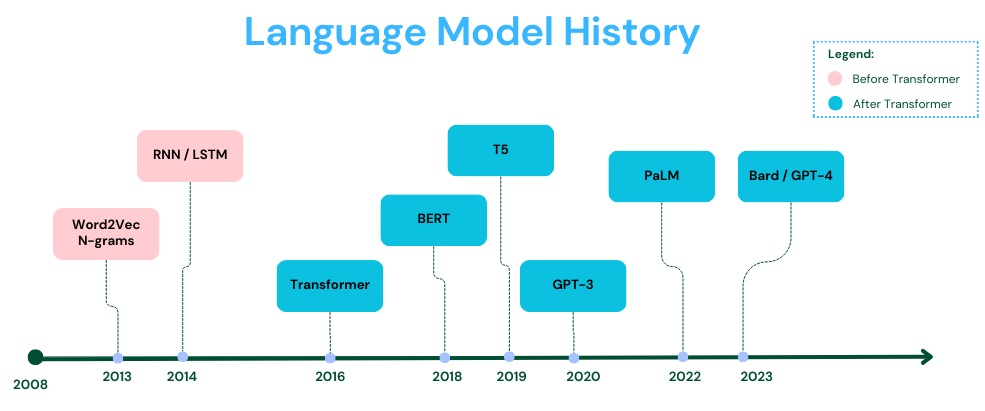

# RISE OF TRANSFORMER ARCHITECTURE

Every tech revolution has a starting point. For the transformer that moment came in 2017 with the publication of an article write by **Ashish Bhaswani** and his team at **Google Brain** named **ATTENTION IS ALL YOU NEED**.
This article introduced a radical new way for AI Models to understand language. The core concept was revolutionary, we could achieve way better performance without than step by step sequencial processing that defining models like **RNNs** and **LSTMs**
The central innovation was the **Attention Mechanism**. It lets the model dynamically focus on the most revelant parts of the input sequence.

# BEFORE ATTENTION MECHANISM

The initial approch used by sequencial processing models like RNNs and LSTMs was representing words as basic numerical vectors. That worked for single words,but for sentences it quickly became a mess. To fix this, the **encoder-decoder** scheme was developed. The encoder would compress the input sequence into a dense numerical state and the decoder will use that state to generate the output. This directy led to **Recurrent Neural Networks (RNNs)** 

RNNs had a simple form of memory. They just pass a hidden state from one word step to the next. That was clever but the sequential nature meant they trained slowly on huge texts, and had a terrible time remembering anything about words that appeared far back in the sentence. To fight that fading memory, **Long-Short-Term Memory (LSTMs)** was introduced, adding complex gating memory mechanisms to control the information flow.

But even LSTMs still process words one at a time. For long sequences, efficiency and accurate context capture were still massive problems.

For something like machine translation, the standart was a sequence-to-sequence RNN, but it had to compress the entire input into a single context vector which meant losing a lot of words

This is what gave birth to the **Attention Mechanism** inside the RNN framework. 

# ATTENTION MECHANISM AS SOLUTION

The introduction of the Attention Mechanism concept allowed the decoder to dynamically focus on most revelant input words, greatly improving context capture. It was no more limited by that one summary vector and could attend to all the encoder's intermediate states. By calculating weights, if figured out which input words were most revelant to the output word it was generating. This dynamic focusing was a huge win, especially for tackling those longer sentences.

# CAN ATTENTION MECHANISM REPLACE RECCURENCE ? 

If attention works between the Encoder/Decoder scheme, can it replace reccurence enterely ? The answer is **YES**.
The Transformer introduced Parallel Self-Attention, enabling simultaneous processing and instantaneous global context capture. This lets the network process every single word at the exact same time, allowing every word to attend to every other word within the same sequence. We now have a dense, instantaneous network of relationships capturing both nearby and super distant context without any of the slow step-by-step memory transfer.This huge performance allowed Transfomer Architecture to become the technological foundation for landmark models like BERT, GPT and T5 forever reshaping the possibilities of AI.
This timeline shows the great impact the transfomers had.

After the transformer hit, we saw an incredible rapid burst of advancements, leading right up to the massive models we use today.
